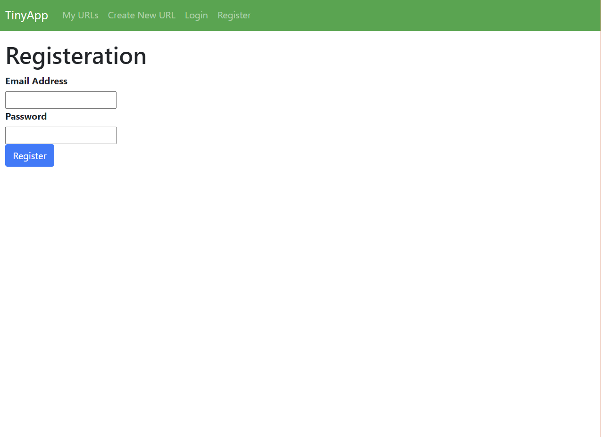
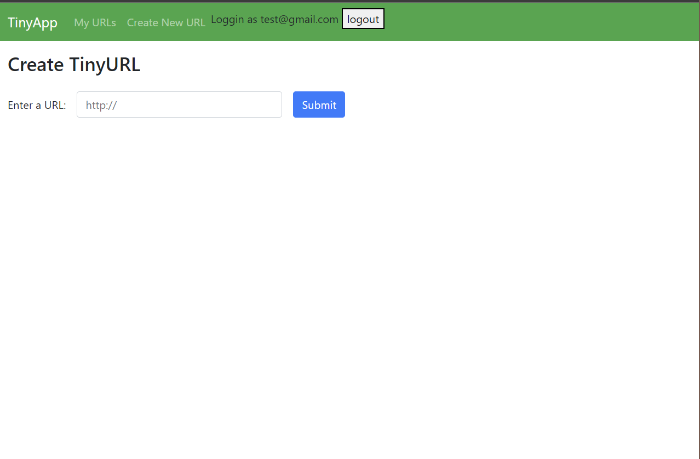
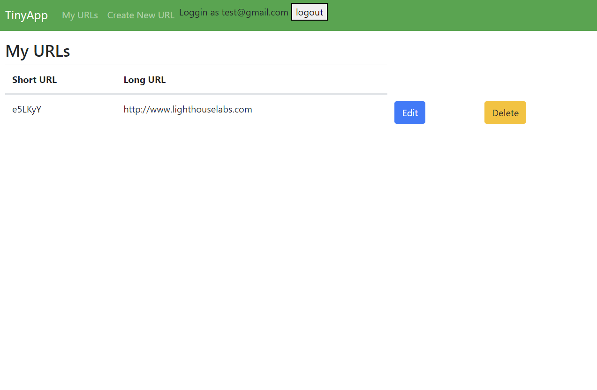

# TinyApp Project

TinyApp is a full stack web application built with Node and Express that allows users to shorten long URLs, much like TinyURL.com and bit.ly do. The purpose of a URL shortener is to make a URL more manageable. For websites like Twitter, where you are limited by the number of characters, a link such as: https://tiny.app/u/b2xVn2 is a lot better than https://web.compass.lighthouselabs.ca/projects/tiny-app. This also makes a URL more shareable and even customisable.

## Final Product

## Dependencies

- Node.js
- Express
- EJS
- bcrypt
- body-parser
- cookie-session

## Getting Started

- Install all dependencies (using the `npm install` command).
- Run the development web server using the `node express_server.js` command.
